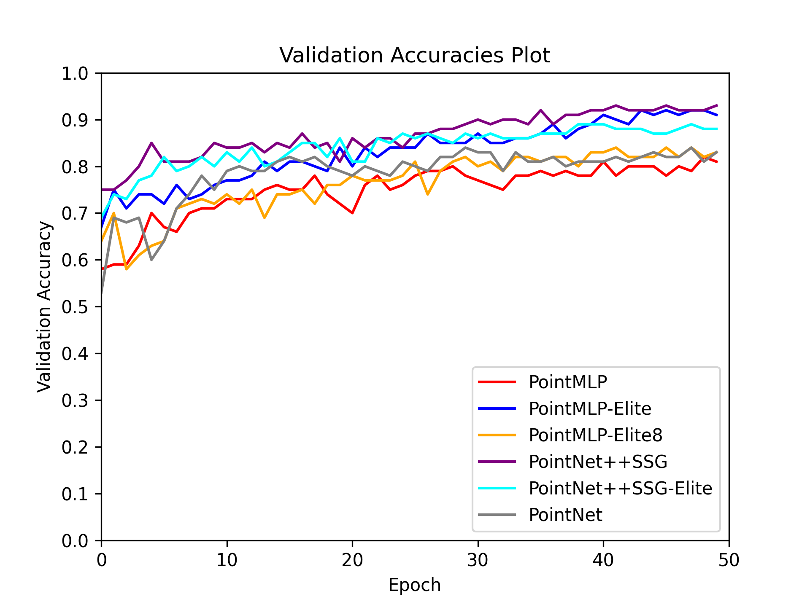
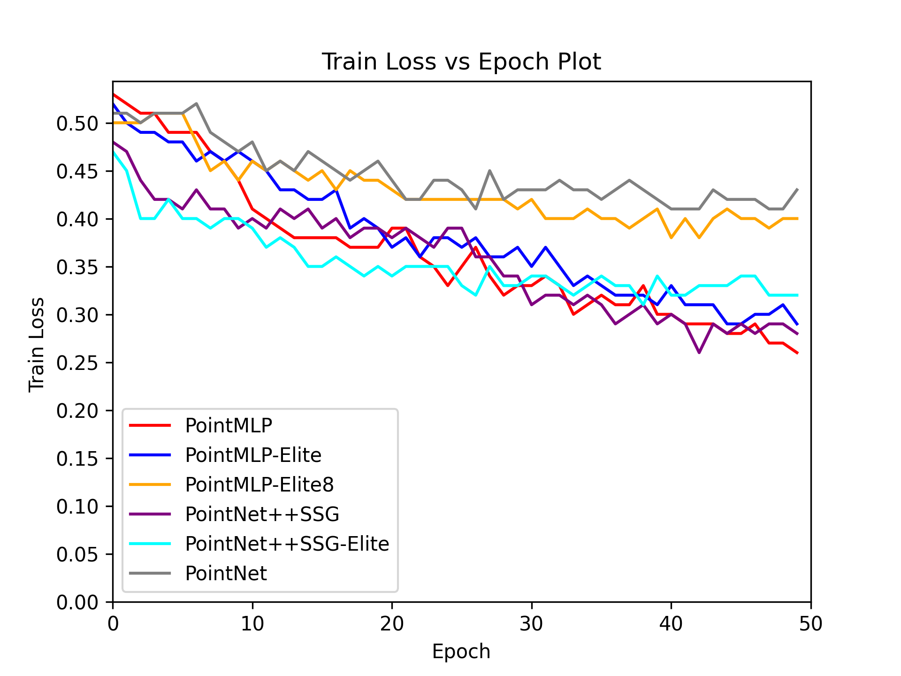
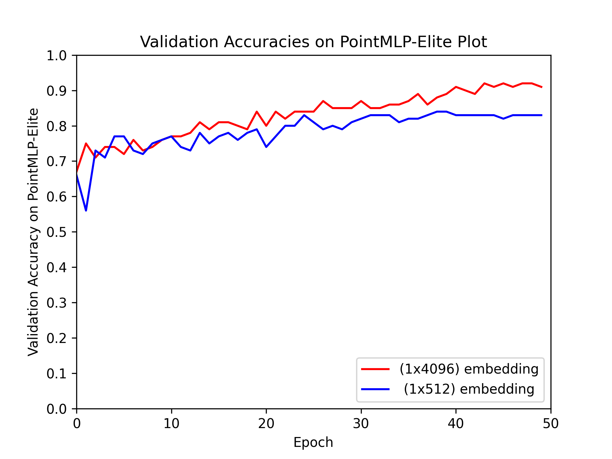
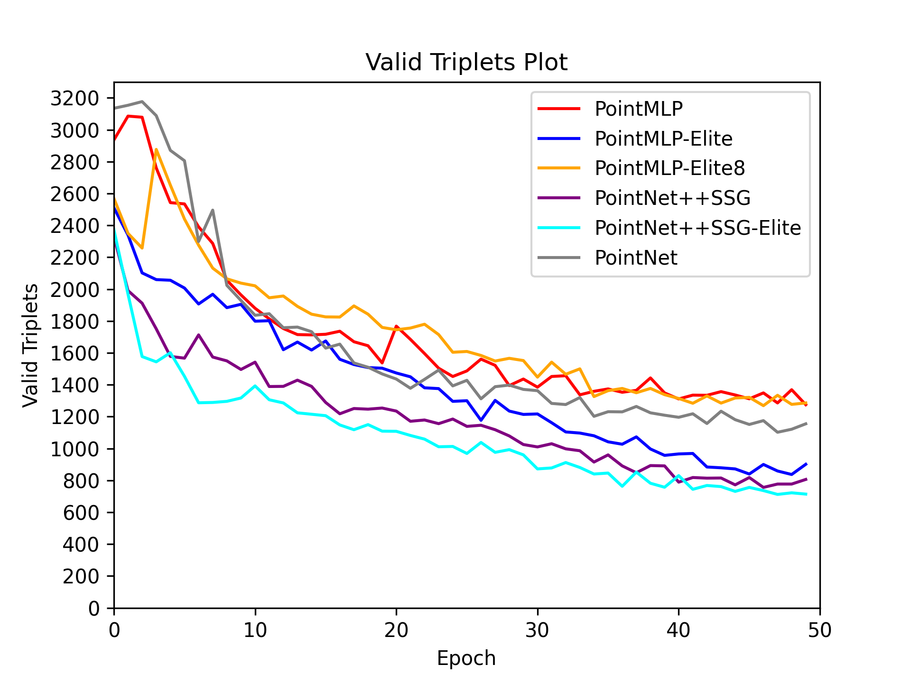

# 3D-face-masked-recognition
Official PyTorch implementation of "Learning similarity and dissimilarity in 3D face masked with PointMLP, PointNet++ and PointNet triplet network"

A pytorch implementation of the "Learning similarity and dissimilarity in 3D face masked with PointMLP, PointNet++ and PointNet triplet network" paper for training a point cloud aware facial recognition model using [Triplet loss][[1](#references)]. Training is done on the [Bosphorus](https://link.springer.com/chapter/10.1007/978-3-540-89991-4_6) dataset which has been pre-processed and augmented using only normal expression and frontal oriented and combine it with our in-house dataset named D415 dataset. PointNet, PointNet++ and PointMLP with different modification is introduced to train on small vram (6GB VRAM) graphic card with gradient accumalation technique. 

Because of the regulation of the dataset, we cannot provide the dataset here. However we had provide code which created the combined datasets for this experiment. 

Please let me know if you find mistakes and errors, or improvement ideas for the code and for future training experiments. Feedback would be greatly appreciated.

__Operating System__: Ubuntu 18.04 (you may face issues importing the packages from the requirements.yml file if your OS differs).

## News & Updates:

- [ ] project page for download dataset for training 
- [ ] logs and pretrained models downloadable from project page
- [ ] journal publish
- [x] paper/codes release
- [ ] testing code of face recognition

### Pre-trained Models Bosphorus+d415 Test Metrics





## Install

```bash
# step 1. clone this repo
git clone https://github.com/azhadzuraimi/3D-face-masked-recognition.git
cd 3D-face-masked-recognition

# step 2. create a conda virtual environment and activate it
conda create --name <environment_name> --file requirements.txt
conda activate <environment_name>
```

```bash
# Optional solution for step 2: install libs step by step
conda create -n <environment_name> python=3.7 -y
conda activate <environment_name>
conda install pytorch==1.10.1 torchvision==0.11.2 cudatoolkit=10.2 -c pytorch -y
pip install cycler einops h5py pyyaml==5.4.1 scikit-learn==0.24.2 scipy tqdm matplotlib==3.4.2
pip install pointnet2_ops_lib/.
```

## Usage

### Pre-trained model
Link to download the pre-trained models using Triplet Loss is underdevelopement.

### Training and Testing Datasets
Link to download the pre-trained models using Triplet Loss is underdevelopement.                                             

### Model Training
__Notes__: 
* Training triplets will be generated at the beginning of each epoch and will be saved in the 'datasets/generated_triplets' directory as numpy files that can be loaded at the beginning of an epoch to start training without having to do the triplet generation step from scratch if required (see the __--training_triplets_path argument__).
* Each triplet batch will be constrained to a number of human identities (see the __--num_human_identities_per_batch__ argument).

### References
* [1] Florian Schroff, Dmitry Kalenichenko, James Philbin, “FaceNet: A Unified Embedding for Face Recognition and Clustering”:
 [arxiv](https://arxiv.org/abs/1503.03832)


## Acknowledgment

Our implementation is mainly based on the following codebases. We gratefully thank the authors for their wonderful works.

[facenet-pytorch-glint360k](https://github.com/tamerthamoqa/facenet-pytorch-glint360k/tree/master)
[pointMLP-pytorch](https://github.com/ma-xu/pointMLP-pytorch)
[Pointnet2_PyTorch](https://github.com/erikwijmans/Pointnet2_PyTorch)
[Pointnet_pytorch](https://www.kaggle.com/code/balraj98/pointnet-for-3d-object-classification-pytorch)

### Hardware Specifications
* NVIDIA GTX 1660ti Graphics Card (6 gigabytes Video RAM).
* i5-10400 Intel CPU.
* 32 Gigabytes DDR4 RAM at 3600 MHz.

## LICENSE
3D-face-masked-recognitionco is under the Apache-2.0 license. 